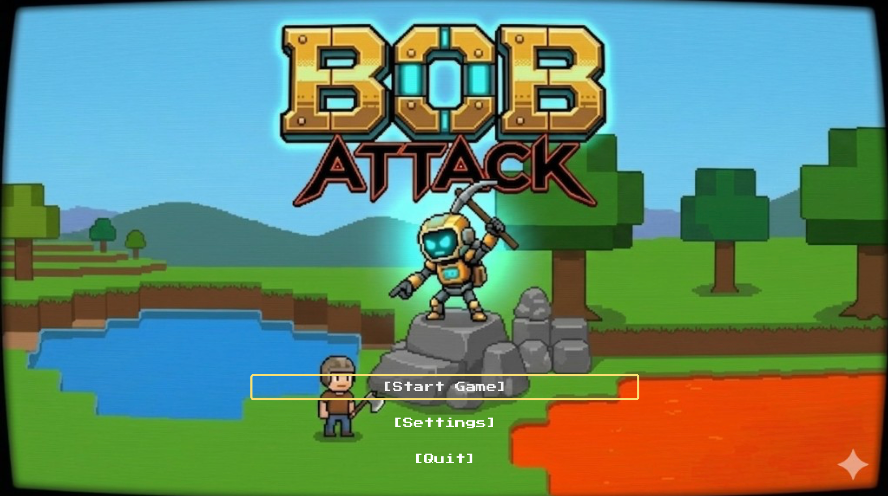

# BOB Survival (BOB ATTACK)

**Name:** [Your name]

**Student Number:** ::STUDENT_NUMBER::

**Class Group:** [Your class group]

---

# Video

Demo video: to be uploaded on Moodle (YouTube link omitted for this submission pass).

---

# Screenshots

Add PNG files under `docs/screenshots/` (see `docs/screenshots/README.md` for suggested shots).

---

# Description of the project

**BOB Survival** is a 2D survival sandbox built in **Godot 4.6**. You gather resources, craft tools, place blocks, manage hunger, and survive alongside **B.O.B.**—an autonomous companion implemented as a finite-state agent with needs, moods, and world interaction. The start screen (`scenes/StartScreen.tscn`) uses the **BOB ATTACK** banner art; the project name in `project.godot` is **BOB Survival Prototype**.

The core loop is gather → craft → build → feed or calm B.O.B. → survive pressure when he enters **ATTACK** mode. Terrain streams infinitely via `WorldTilemap`; inventory and crafting live in `GameManager`.

---

# Instructions for use

## Requirements

- **Godot Engine 4.6** (matches `config/features` in `project.godot`).
- Desktop OS (macOS, Windows, or Linux) with keyboard and mouse.

## Run from source

1. Install [Godot 4.6](https://godotengine.org/download).
2. Open this folder in the Godot Project Manager (`project.godot`).
3. Press **F5** (Run Project). Main scene: `res://scenes/StartScreen.tscn`.
4. Choose **Start** to load `res://scenes/Main.tscn`.

Volume, fullscreen, and vsync persist via `RunRecords` / `scripts/start_screen.gd`. Master, **Music**, and **SFX** buses are defined in `default_bus_layout.tres`; gameplay SFX route to the **SFX** bus so the start-screen sliders still work.

## Export (desktop)

1. In Godot: **Project → Export…**
2. Select preset **macOS Desktop** or **Windows Desktop** (`export_presets.cfg`).
3. If export templates are missing, use **Editor → Manage Export Templates** and install Godot 4.6 templates.
4. Set an output path under `exports/` (ignored by git) and click **Export Project**.
5. Run the exported `.app` (macOS) or `.exe` (Windows).

**macOS note:** You may need to allow the app in **System Settings → Privacy & Security** on first launch if it is unsigned.

---

# How it works

## Player and world

The player (`scripts/player.gd`) moves on a tilemap with gravity, mines blocks under the cursor (tool-dependent), places dirt/stone/reinforced blocks, farms with the hoe, and fights with melee tools. `WorldTilemap` handles streaming, mining damage, drops, and placement rules. `GameManager` tracks inventory, hunger, crafting costs, and run records.

## B.O.B. (autonomous agent)

B.O.B. (`scripts/bob_agent.gd`) is a **CharacterBody2D** with an internal **`BobMode`** enum (**FRIENDLY** / **ATTACK**). Each frame he updates **hunger**, **safety**, **curiosity**, **energy**, **trust**, and **affection**, then picks movement and actions from the active mode.

- **FRIENDLY:** forages and mines exposed tiles, seeks berries, wanders near the player when close.
- **ATTACK:** chases the player, bites when hungry enough, annoys/shoves, may sabotage inventory, break chests, place climb steps, or bury berry bushes near a low-health player.

**Mode selection** runs on a timer: when it expires, a **bias_to_attack** score is built from tunable exports (hunger, trust, energy, sword proximity, hurt enrage, early-game grace, randomness) and compared to `randf()`. **Calm Totems** force **FRIENDLY** while the player stands in the aura. **Sword hits** apply HP damage, start **hurt enrage**, and lock **ATTACK** for a minimum duration. After death, B.O.B. respawns off-screen still angry.

This is deliberate **autonomous-agent** design: behavior is explainable from exported numbers and state, not scripted cutscenes.

## Audio

Short SFX under `assets/audio/sfx/` play through `GameSfx` (`scripts/game_sfx.gd`) on the **SFX** bus: mining, placement, craft menu open, UI clicks, B.O.B. bite, and switching to attack mode. Procedural WAV files were generated for this repo (see References).

---

# Controls summary

| Action | Key |
|--------|-----|
| Move | **A** / **D**, **S** down, **W** up / climb intent |
| Jump | **Space** (also **W** when grounded) |
| Interact / gather | **E** |
| Mine / break | **Left mouse**, **S** (also bound to move down—prefer mouse for mining) |
| Place block | **V** (hold to repeat) |
| Cycle place material | **X** |
| Place Calm Totem | **T** |
| Feed B.O.B. | **Q** |
| Tools | **1** sword, **2** pickaxe, **3** axe, **4** shovel, **5** hoe |
| Craft menu | **C** or **F** |
| Craft shovel (menu open) | **6** |
| Pause | **Escape** (closes craft first if open) |
| Debug overlay | **I** |

Full detail matches `project.godot` input map and `scripts/start_screen.gd` settings labels.

---

# List of classes / assets in the project

| Class / asset | Source |
|---------------|--------|
| `scripts/player.gd`, `scripts/main.gd`, `scripts/game_manager.gd` | Self-written |
| `scripts/bob_agent.gd` | Self-written (FSM + needs autonomous agent) |
| `scripts/world_tilemap.gd`, `scripts/run_records.gd` | Self-written |
| `assets/kenney/block-pack/` | [Kenney Block Pack](https://kenney.nl/assets/block-pack) — CC0 |
| `assets/blockpack/` | Kenney-derived / in-project tile and prop art |
| `assets/kaykit/` | KayKit character textures (see `assets/kaykit/`) |
| `assets/tiny16/` | Tiny 16-style sprite sheets used for actors |
| `assets/characters/player_new.png`, `bob_new.png` | Project character art |
| `assets/fonts/PressStart2P-Regular.ttf` | [Press Start 2P](https://fonts.google.com/specimen/Press+Start+2P) — SIL Open Font License |
| `assets/ui/bob_attack_start_screen.png` | Project UI |
| `assets/audio/sfx/*.wav` | Procedural placeholders generated for this submission (CC0-style, documented here) |
| `study/`, `csresources-main/` | Local coursework reference only (gitignored, not required to run) |

---

# References

- Godot 4.6 documentation: https://docs.godotengine.org/
- Kenney — Block Pack (CC0): https://kenney.nl/assets/block-pack
- Course assignment README template: https://github.com/skooter500/csresources/blob/main/assignment/README.md
- Press Start 2P font: https://fonts.google.com/specimen/Press+Start+2P
- Procedural SFX in `assets/audio/sfx/`: short tones/noise generated locally for royalty-free use in this prototype

---

# What I am most proud of in the assignment

I am most proud of **B.O.B. as a readable autonomous agent**. He is not a simple chase script: `bob_agent.gd` combines a **mode timer**, **need variables**, and a **bias_to_attack** calculation so you can tune personality in the Inspector and still predict outcomes. Watching him switch from friendly foraging to attack after a sword hit—or calm down inside a totem aura—feels like emergent companionship rather than a single animation loop. Getting mining, placement, crafting, and Bob’s tile interactions to share one `WorldTilemap` without breaking each other took real integration work, and I think that shows in play.

---

# What I learned

I learned how to structure **game AI as explicit state plus numeric needs** instead of one giant `if` chain. Splitting **FRIENDLY** and **ATTACK** behaviors, then driving transitions with timers, trust, hunger, and player actions, maps well to the autonomous-agents ideas from class. On the engine side, I got comfortable with Godot 4’s **TileMapLayer** streaming, **input action** maps, **audio buses** (Master / Music / SFX), and export presets. Debugging Bob—especially shared keys like **S** on move-down and mine—taught me to document controls clearly and test edge cases where systems overlap.

---

# Proposal submitted earlier can go here (if there is one)

[Optional: link or paste your earlier proposal if required by your lecturer.]
