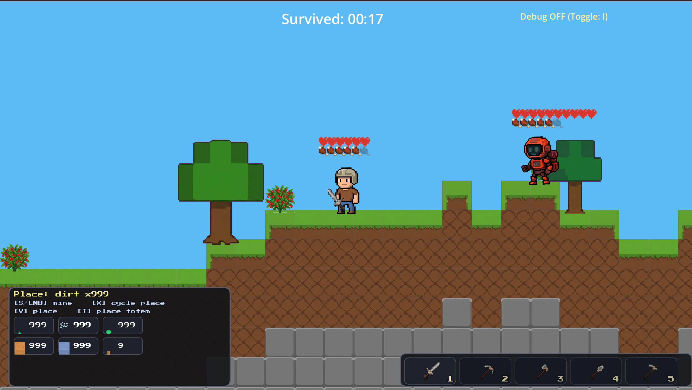
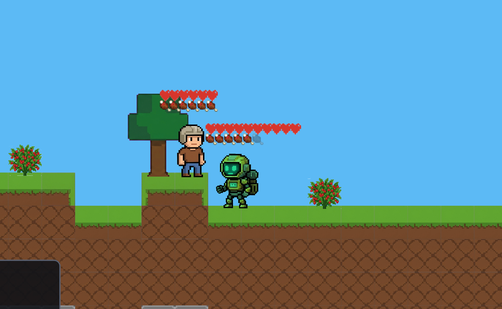
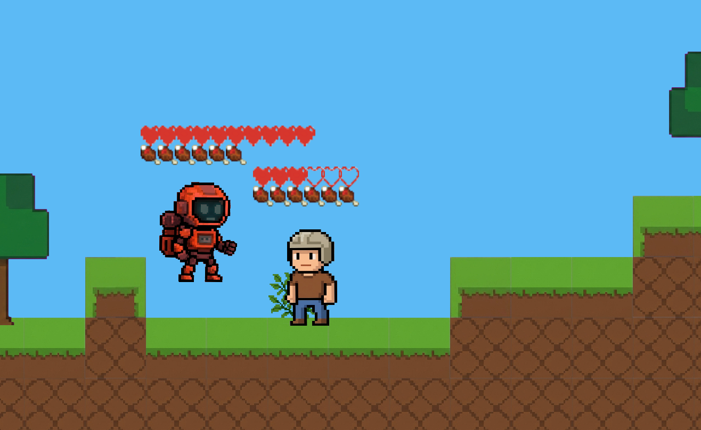
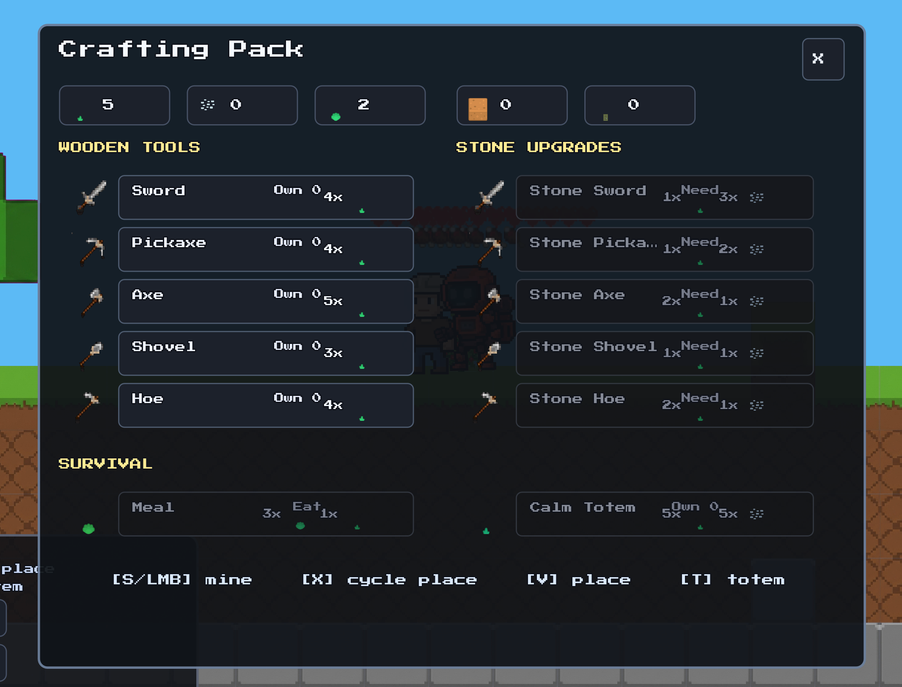

# BOB Survival (BOB ATTACK)

**Name:** Seán Flood

**Student Number:** C22421292

---

# Video

Demo video: to be uploaded on Moodle (YouTube link omitted for this submission pass).

---

# Screenshots

## Start screen

## Gameplay overview

## B.O.B. friendly mode

## B.O.B. attack mode

## Crafting menu

---

# Description of the project

**BOB Survival** is a 2D survival sandbox built in **Godot 4.6**. You gather resources, craft tools, place blocks, manage hunger, and survive alongside **B.O.B.**—an autonomous companion implemented as a finite-state agent with needs, moods, and world interaction. The start screen (`scenes/StartScreen.tscn`) uses the **BOB ATTACK** banner art; the project name in `project.godot` is **BOB Survival Prototype**.

The core loop is gather → craft → build → feed or calm B.O.B. → survive pressure when he enters **ATTACK** mode. Terrain streams infinitely via `WorldTilemap`; inventory and crafting live in `GameManager`.

---

# Instructions for use

## Requirements

- **Godot Engine 4.6** (matches `config/features` in `project.godot`).
- Desktop OS (macOS, Windows, or Linux) with keyboard and mouse.

## Run from source

1. Install [Godot 4.6](https://godotengine.org/download).
2. Open this folder in the Godot Project Manager (`project.godot`).
3. Press **F5** (Run Project). Main scene: `res://scenes/StartScreen.tscn`.
4. Choose **Start** to load `res://scenes/Main.tscn`.

Volume, fullscreen, and vsync persist via `RunRecords` / `scripts/start_screen.gd`. Master, **Music**, and **SFX** buses are defined in `default_bus_layout.tres`; gameplay SFX route to the **SFX** bus so the start-screen sliders still work.

## Export (desktop)

1. In Godot: **Project → Export…**
2. Select preset **macOS Desktop** or **Windows Desktop** (`export_presets.cfg`).
3. If export templates are missing, use **Editor → Manage Export Templates** and install Godot 4.6 templates.
4. Set an output path under `exports/` (ignored by git) and click **Export Project**.
5. Run the exported `.app` (macOS) or `.exe` (Windows).

**macOS note:** You may need to allow the app in **System Settings → Privacy & Security** on first launch if it is unsigned.

---

# How it works

## Player and world

The player (`scripts/player.gd`) moves on a tilemap with gravity, mines blocks under the cursor (tool-dependent), places dirt/stone blocks, farms with the hoe, and fights with melee tools. `WorldTilemap` handles streaming, mining damage, drops, and placement rules. `GameManager` tracks inventory, hunger, crafting costs, and run records.

## B.O.B. (autonomous agent)

B.O.B. (`scripts/bob_agent.gd`) is a **CharacterBody2D** with an internal **`BobMode`** enum (**FRIENDLY** / **ATTACK**). Each frame he updates **hunger**, **safety**, **curiosity**, **energy**, **trust**, and **affection**, then picks movement and actions from the active mode.

- **FRIENDLY:** forages and mines exposed tiles, seeks berries, wanders near the player when close.
- **ATTACK:** chases the player, bites when hungry enough, annoys/shoves, may sabotage inventory, place climb steps, or bury berry bushes near a low-health player.

**Mode selection** runs on a timer: when it expires, a **bias_to_attack** score is built from tunable exports (hunger, trust, energy, sword proximity, hurt enrage, early-game grace, randomness) and compared to `randf()`. **Calm Totems** force **FRIENDLY** while the player stands in the aura. **Sword hits** apply HP damage, start **hurt enrage**, and lock **ATTACK** for a minimum duration. After death, B.O.B. respawns around 10 blocks away still angry.

This is deliberate **autonomous-agent** design: behavior is explainable from exported numbers and state.

## Audio

Short SFX under `assets/audio/sfx/` play through `GameSfx` (`scripts/game_sfx.gd`) on the **SFX** bus: mining, placement, craft menu open, UI clicks, B.O.B. bite, and switching to attack mode. Procedural WAV files were generated for this repo (see References).

---

# Controls summary

| Action | Key |
|--------|-----|
| Move | **A** / **D**, **S** down, **W** up / climb intent |
| Jump | **Space** / **W** |
| Interact / gather | **E** |
| Mine / break | **Left mouse**, **S** (also bound to move down—prefer mouse for mining) |
| Place block | **V** (hold to repeat) |
| Cycle place material | **X** |
| Place Calm Totem | **T** |
| Tools | **1** sword, **2** pickaxe, **3** axe, **4** shovel, **5** hoe |
| Craft menu | **C** or **F** |
| Pause | **Escape** (closes craft first if open) |

Full detail matches `project.godot` input map and `scripts/start_screen.gd` settings labels.

---

# List of classes / assets in the project

| Class / asset | Source |
|---------------|--------|
| `scripts/player.gd`, `scripts/main.gd`, `scripts/game_manager.gd` | Self-written |
| `scripts/bob_agent.gd` | Self-written (FSM + needs autonomous agent) |
| `scripts/world_tilemap.gd`, `scripts/run_records.gd` | Self-written |
| `assets/tiles/`, `assets/blockpack/`, `assets/decor/`, `assets/food/` | Project-owned tile, block, prop, tree, and food art; AI-generated and then selected/edited for this game |
| `assets/characters/player_new.png`, `assets/characters/bob_new.png` | Project-owned AI-generated character art for the player and B.O.B. |
| `assets/tools/tool_strip.png` | Project-owned tool icon strip used by the HUD and crafting menu |
| `assets/fonts/PressStart2P-Regular.ttf` | [Press Start 2P](https://fonts.google.com/specimen/Press+Start+2P) — SIL Open Font License |
| `assets/ui/bob_attack_start_screen.png`, `assets/ui/*_ui16.png` | Project-owned UI/start-screen art and HUD icons |
| `assets/audio/sfx/*.wav` | Procedural sound effects generated locally for this submission |

---

# References

- Godot 4.6 documentation: https://docs.godotengine.org/
- Press Start 2P font: https://fonts.google.com/specimen/Press+Start+2P
- Project art assets in `assets/tiles/`, `assets/blockpack/`, `assets/characters/`, `assets/decor/`, `assets/food/`, `assets/tools/`, and `assets/ui/`: AI-generated/project-created assets used only for this coursework prototype
- Procedural SFX in `assets/audio/sfx/`: short tones/noise generated locally for royalty-free use in this prototype

---

# What I am most proud of in the assignment

I am most proud of **B.O.B Attack** not only being a great showcase of an autonomous agent but also a fun game with challenge to it. Then as well I am proud of B.O.B not being a simple chase script: `bob_agent.gd` combines a **mode timer**, **need variables**, and a **bias_to_attack** calculation so you can tune his behaviour and personality. Seeing him switch based on player interaction, environment around him, or hunger levels is very satisfying.

---

# What I learned

I learned how to structure **game AI as explicit state plus numeric needs** instead of one giant `if` chain. Splitting **FRIENDLY** and **ATTACK** behaviors, then driving transitions with timers, trust, hunger, and player actions, maps well to the autonomous-agents ideas from class. I learned about state machines and how they work with the before mentioned variables to create "human like" movement and behaviour. On the engine side, I got comfortable with Godot 4’s **input action** maps, **audio buses** (Master / Music / SFX), and export presets.

---

# Project Proposal

[AA Assignment Proposal](docs/proposal/aa-assignment-proposal.pdf)
